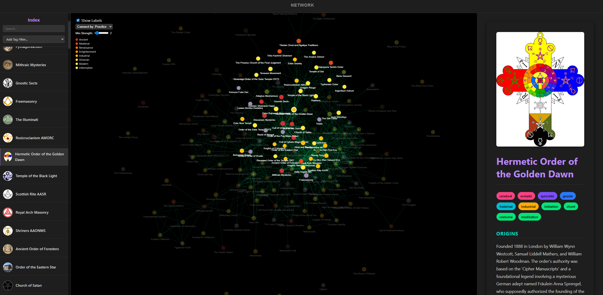

# Occultopedia

A database of real and fictional societies and cults, browsable as a network graph and a timeline.

- [**Access the website**](https://dominiquemakowski.github.io/Occultopedia/)



## Using the atlas

- **Timeline** (the default view) places each society on a logarithmic time axis. Scroll, drag the
  canvas, or drag the ruler on the right — which doubles as a scrollbar over the whole span — to
  travel in time; zoom with the <kbd>+</kbd> / <kbd>−</kbd> buttons (or pinch on a touchpad). Each
  entry keeps a fixed column so the lines of influence stay readable, and names are placed only where
  they do not collide — zoom in to reveal the rest. Hover an entry for its dates, select
  one to light up its lineage. Entries with no start date — invented orders, and anything still
  missing a `tags.js` record — are scattered through the hatched **Beyond the scale** band under the
  "today" line.
- **Network** links societies that share tags. Choose what counts as a link ("Connect by") and how many
  shared tags are required ("Min. shared tags").
- **Search** matches names, tags, and the full text of every entry.
- Press <kbd>/</kbd> to jump to the search box, and <kbd>↑</kbd>/<kbd>↓</kbd> to walk through the index.

## Linking and citing

Every entry has a stable permalink of the form:

```
https://dominiquemakowski.github.io/Occultopedia/#/Knights_Templar_Historical
```

The current view is part of the URL too, so a link can carry the whole state:

```
https://dominiquemakowski.github.io/Occultopedia/?view=network&mode=practice&min=3#/Freemasonry
```

Each entry carries a **Cite this entry** panel with a permalink plus ready-made APA and BibTeX
references.

## Data

The site is static — no build step, no dependencies. The data lives in three plain JavaScript files
that can be read or parsed directly:

| File          | Contents                                                                  |
| ------------- | ------------------------------------------------------------------------- |
| `database.js` | Prose entries: origins, beliefs, practices, structure                     |
| `tags.js`     | Tags, start/end dates, and `inspiredBy` links between entries             |
| `images.js`   | Manifest mapping each entry to its images in `img/`                       |

Images in `img/` are capped at 1600px; `img/thumbs/` holds the small versions used by the index.

## Contribute

If you've spotted a mistake or you'd like to expand or add more information, please open an issue or
submit a pull request. Contributions are very welcome!
